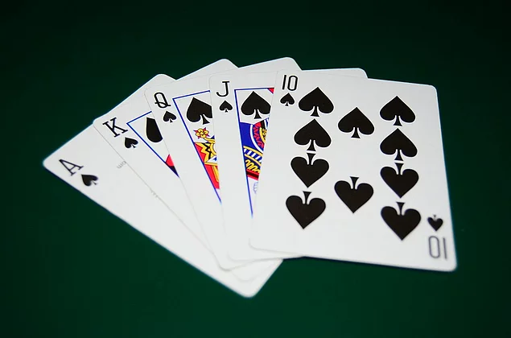
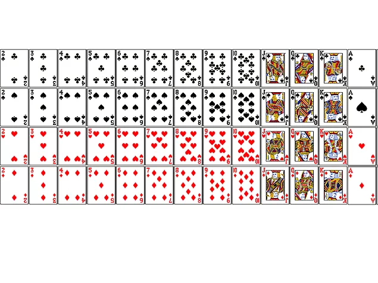

# Batak-Gym

This game is a challenging environment for AI projects. One version of the game is the same with spades. It is similar to spades, hearts, bid whist, contract bridge and tarneeb. We will be implementing versions of this game eventually.

## Reinforcement Learning

Batak is a POMDP problem. Its observability is limited to one's hand and the actively picked cards at turns.

## Milestones

We are planning to release this environment step by step.

1. [ ] No bidding, spades is the default trump.
2. [ ] With bidding, spades is the default trump.
3. [ ] With bidding, highest bidder sets the trump.

## Rules

### Default Rules

- The classic batak game is played with 4 people. The default deck contains 52 cards. These 52 cards are distributed equally to 4 people. So at the beginning of the game each player has 13 cards.
- (If the game contains bidding session) The bidding opens with 5. Other players may raise or pass the bid respectively. If no-one bids, the first bidder is considered to have entered the bidding with 4.
- The player who won the bidding starts the game.
- Can't play another suit, if one has the current trick's suit.
- Can't lead trump until trump is broken.
- After all the cards have been played, points are tallied for each player.

### Activatable Rules

- Must play bigger card if present. (As an example: hearts-7 was thrown on the ground. You also have hearts-5 and hearts-9 and hearts-king. You have to throw at least hearts-9. If the cards in your hand do not pass the cards on the floor, you can play any card)
- The number of cards in a deck can be changed with easy setup.
- The game includes four different types of cards: clubs, diamonds, spades and hearts.

## Rewards

### Rewards without bidding

1. After every character plays a card and hand is decided, a reward is issued as 1 or 0.
2. After all the cards have been played, reward is issued as taken hands times 10.

### Rewards with bidding

### Spades style

1. After every character plays a card and hand is decided, a reward is issued as 1 or 0.
2. If the player failed the bid reward is -10 times bid. If the player won the bid reward is 10 times bid.

### Batak style

1. After every character plays a card and hand is decided, a reward is issued as 1 or 0.
2. Player is the bidder and wons the bid, reward is +1 times bid.
3. Player is the bidder and fails the bid, reward is -1 times bid.
4. Player is not the bidder and takes nothing reward is the -1 times bidder's bid.
